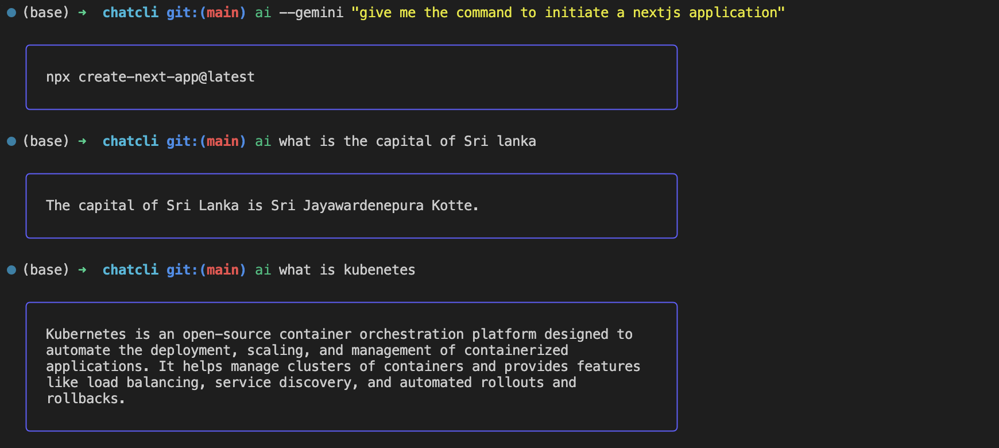

# cchat

**cchat** is a lightweight, interactive terminal-based CLI tool to chat with Large Language Models (LLMs) like OpenAI's ChatGPT, Google Gemini, and Anthropic Claude — right from your shell.

> No more clunky web UIs — just type and chat.

---

## ✨ Features

- 🧠 Chat with OpenAI, Gemini, or Claude from your terminal
- ⚙️ Simple config setup with `chat init`
- 🎛️ Set a default provider
- 💬 Natural CLI usage: `cchat --gemini "Tell me a joke"`
- 🌀 Smooth spinners and colored terminal output
- 🧩 Easily extensible to support more providers

---

## 📦 Installation (Script - MacOS or ZSH Terminal)

### 🚀 Installation script

We provide an install.sh script that automatically downloads and installs the correct binary for your OS/architecture from the GitHub release.

Run this command to install:

```sh
sh -c "$(curl -fsSL https://raw.githubusercontent.com/ShakthiW/chatcli/main/zsh-plugin/cchat.plugin.zsh)"
```

> 💡 This will download the correct binary and add the alias `ai` to your `.zshrc`.

---

## 📦 Installation (By Clone)

### 1. Clone the repo

```bash
git clone https://github.com/ShakthiW/cchat.git
cd cchat
```

### 2. Build the CLI

go build -o cchat

### 3. Move it to your PATH

mv cchat /usr/local/bin/

## 🧪 Usage

### 🔧 Initialize with API keys

```bash
cchat init --openai-key=sk-... --gemini-key=... --provider=openai
```

### 💬 Chat

```bash
ai --openai "What's the capital of France?" | cchat chat --openai "What's the capital of France?"
ai --gemini "Explain quantum entanglement" | cchat chat --gemini "Explain quantum entanglement"
ai --claude "Write a haiku about the ocean" | cchat chat --claude "Write a haiku about the ocean"
```

You can skip the flag if you've set a default provider.

```bash
cchat init --default-provider openai
cchat chat "What's the capital of France?" | ai "What's the capital of France?"
```

## ⚙️ Configuration

Config is stored at:

```bash
~/.config/cchat/config.json
```

You can manually edit this file or re-run cchat init to update values.

## 🛠️ Roadmap

- OpenAI & Gemini Support
- Claude Support
- Streaming responses
- Session history
- Plugin-based provider system

## 🧑‍💻 Development

Make sure you have Go installed. Then run the project:

```bash
go run main.go
```

## 🪪 License

This project is licensed under the MIT License. See LICENSE for details.

## 📬 Contact

Made with ❤️ by [Shakthi Warnakulasuriya](https://github.com/ShakthiW)

## Example Usage


